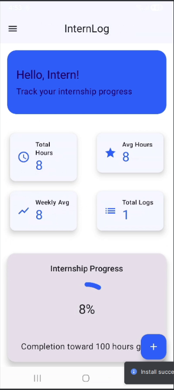
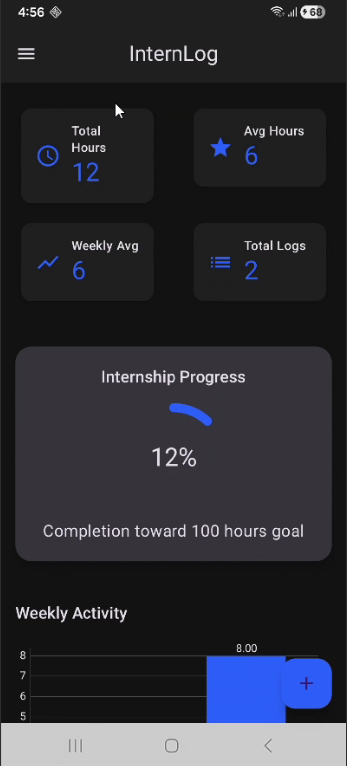
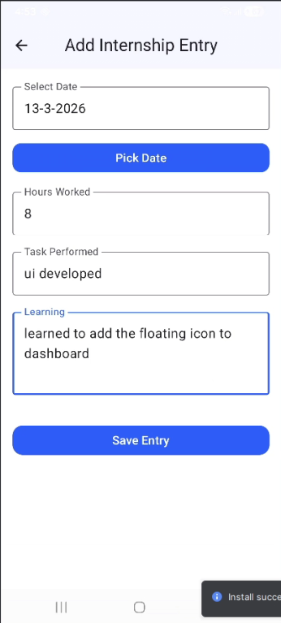
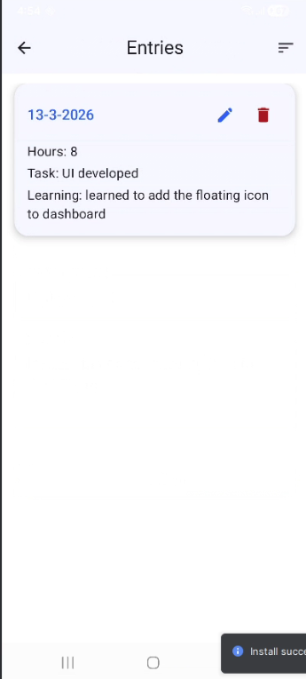
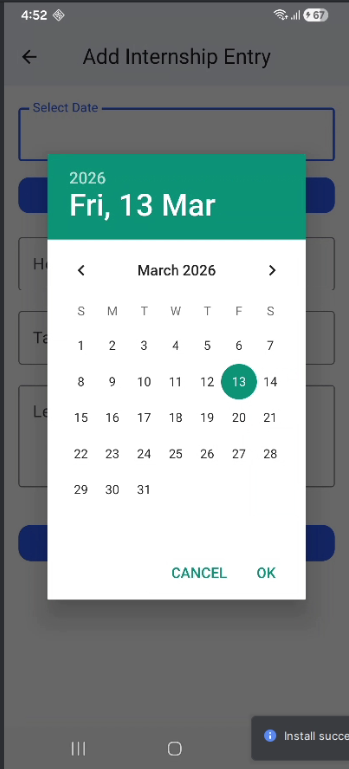
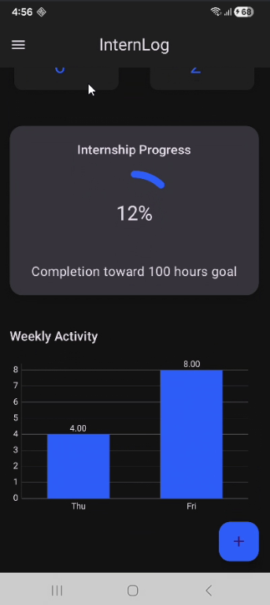

# 📘 Internship Diary App

An Android application built using **Kotlin** and **Jetpack Compose** to help students track their daily internship activities, working hours, and learning progress.

---

## ✨ Features

• Add daily internship entries  
• Edit and delete existing entries  
• Dashboard showing internship statistics  
• Weekly activity chart  
• Internship progress tracking toward goal hours  
• Light and Dark theme support  

---

## 🛠 Tech Stack

- **Language:** Kotlin
- **UI Framework:** Jetpack Compose
- **Architecture:** MVVM
- **Charts:** Compose chart visualization
- **State Management:** ViewModel

---

## 📱 Screenshots

### Dashboard (Light Mode)

### Dashboard (Dark Mode)

### Add Internship Entry

### Entries List

### Date Picker

### Internship Progress Chart

---

## 📊 Internship Tracking

The app allows users to:

- Log daily internship hours
- Record tasks performed
- Track learning outcomes
- Visualize progress toward internship completion

---

## 🚀 Future Improvements

• Export internship reports  
• Cloud sync for entries  
• Notifications for daily logging  
• Improved analytics dashboard  

---

## 📄 License

This project is licensed under the **GNU GPL v3 License**.
